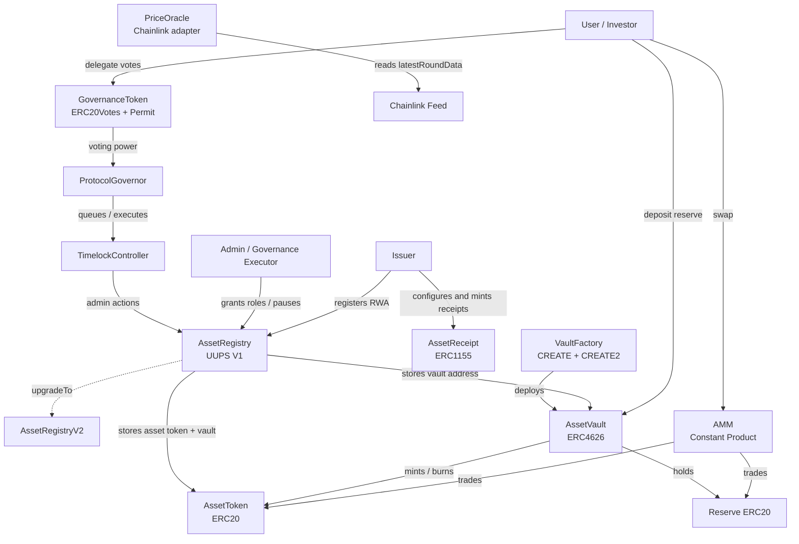

# Architecture Report

## Scenario

The final scenario is `Option C - RWA Tokenization Platform`.

The protocol tokenizes real-world assets through a registry, reserve-backed ERC4626 vaults, ERC20 asset tokens, ERC1155 asset receipts, governance, oracle pricing, and an AMM for secondary liquidity.

## Contract Set

| Contract | Role |
| --- | --- |
| `GovernanceToken` | ERC20Votes governance token with ERC20Permit support. |
| `ProtocolGovernor` | OpenZeppelin Governor module connected to a timelock. |
| `TimelockController` | Delays approved governance execution. |
| `AssetToken` | Fungible reserve-backed asset token. |
| `AssetReceipt` | ERC1155 companion receipt for RWA metadata and per-asset issuance caps. |
| `AssetRegistry` | UUPS-upgradeable registry for issuers, assets, vaults, and lifecycle state. |
| `AssetRegistryV2` | Upgrade target proving V1 to V2 upgradeability. |
| `AssetVault` | ERC4626 reserve vault that mints and burns `AssetToken`. |
| `AMM` | Constant-product liquidity pool with slippage checks and `SafeERC20`. |
| `VaultFactory` | CREATE and CREATE2 vault deployment factory. |
| `PriceOracle` | Chainlink-compatible oracle adapter with stale-price checks. |

## Access Model

| Role | Contract | Purpose |
| --- | --- | --- |
| `DEFAULT_ADMIN_ROLE` | `AssetRegistry`, `AssetToken`, `AssetReceipt` | Root role administration. |
| `ISSUER_ADMIN_ROLE` | `AssetRegistry` | Grants and revokes issuers. |
| `ISSUER_ROLE` | `AssetRegistry`, `AssetReceipt` | Registers assets and mints receipt tokens. |
| `PAUSER_ROLE` | `AssetRegistry` | Pauses and unpauses registered assets. |
| `UPGRADER_ROLE` | `AssetRegistry` | Authorizes UUPS upgrades. |
| `MINTER_ROLE` | `AssetToken` | Allows vault-backed minting. |
| `BURNER_ROLE` | `AssetToken` | Allows vault-backed burning. |
| `URI_MANAGER_ROLE` | `AssetReceipt` | Configures ERC1155 receipt metadata and caps. |

## Contract Relationship Diagram

## Upgradeability Scope

Only `AssetRegistry` is UUPS-upgradeable. This keeps upgrade risk concentrated in the metadata and role-management layer while the value-moving vault, AMM, asset token, and receipt token remain non-upgradeable. `AssetRegistryV2` proves that authorized upgrades work and that unauthorized upgrades revert.

## Security Assumptions

- Issuers are permissioned through `ISSUER_ROLE`.
- Asset pause/unpause is controlled by `PAUSER_ROLE`.
- Vault minting and burning are role-gated on `AssetToken`.
- AMM swaps require minimum output checks to limit slippage.
- Oracle prices reject stale, negative, and incomplete rounds.
- Governance execution is delayed through `TimelockController`.
