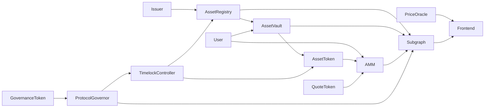
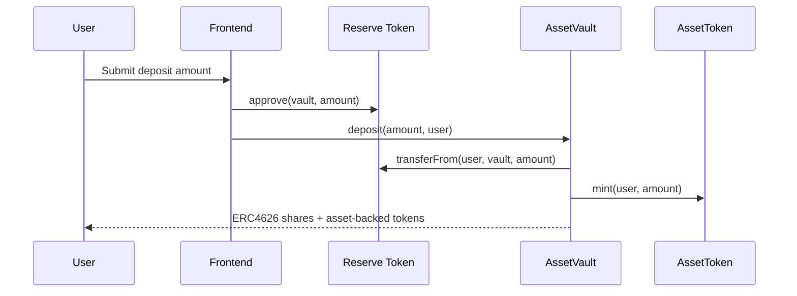
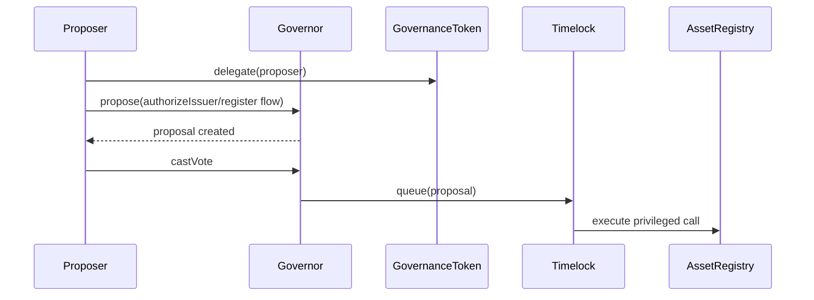
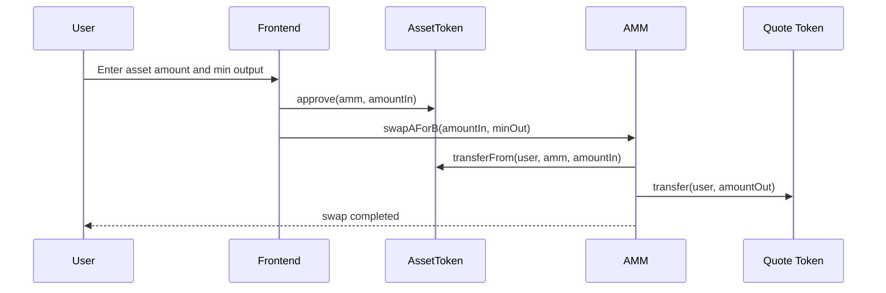

# Option C Architecture

## 1. System Overview

The project implements `Option C — RWA Tokenization Platform` as a modular protocol with five main surfaces:

1. Asset onboarding through an upgradeable `AssetRegistry`
2. Reserve-backed minting and redemption through `AssetVault`
3. Secondary market trading through a custom constant-product `AMM`
4. Protocol governance through `GovernanceToken + ProtocolGovernor + TimelockController`
5. Off-chain indexing and presentation through `The Graph` subgraph and the React frontend

## 2. Component Responsibilities

| Component | Responsibility |
| --- | --- |
| `AssetRegistry` | Registers approved RWA assets, stores issuer and token/vault metadata, supports UUPS upgrades |
| `AssetRegistryV2` | Demonstrates the documented upgrade path from V1 to V2 |
| `AssetToken` | ERC-20 representation of the collateral-backed asset, with role-gated mint and burn |
| `AssetReceipt` | ERC-1155 receipt layer for issuer-side or inventory-style receipt tracking |
| `AssetVault` | ERC-4626 reserve vault that mints and burns the asset-backed ERC-20 one-to-one against deposited collateral |
| `AMM` | Custom CPMM with 0.3% fee, slippage protection, LP token minting, and assembly benchmark |
| `GovernanceToken` | ERC20Votes + ERC20Permit governance token |
| `ProtocolGovernor` | OpenZeppelin Governor stack configured for proposal lifecycle and timelock execution |
| `VaultFactory` | CREATE and CREATE2 vault deployment factory |
| `PriceOracle` | Chainlink-compatible price feed adapter with stale-price and invalid-round protection |

## 3. High-Level Architecture

## 4. Critical User Flows

### 4.1 Reserve Deposit and Mint

### 4.2 Asset Onboarding via Governance

### 4.3 Secondary Market Swap

## 5. Storage Layout Summary

### `AssetRegistry`

| Slot Group | Variables | Notes |
| --- | --- | --- |
| Initialization | `_initialized` | One-time initializer flag for proxy deployment |
| Registry counters | `assetCount` | Tracks total registered assets |
| Asset storage | `_assets` | `bytes32 => AssetRecord` mapping storing issuer, reserve, token, vault, supply, URI, active flag |

Upgradeable storage safety argument:

- `AssetRegistryV2` only appends new behavior and does not reorder inherited state.
- No storage variables were inserted ahead of existing `AssetRegistry` fields.

### `AssetToken`

| Variable | Purpose |
| --- | --- |
| `MINTER_ROLE` / `BURNER_ROLE` | Authorizes vault-side mint and burn actions |
| `MAX_SUPPLY` | Hard cap on aggregate minted supply |

### `AssetVault`

| Variable | Purpose |
| --- | --- |
| `assetToken` | Linked ERC-20 minted against deposits |
| `totalDeposited` | Tracks cumulative active collateral backing |
| `userDeposits` | Per-user accounting for withdrawals and health checks |

### `AMM`

| Variable | Purpose |
| --- | --- |
| `tokenA` / `tokenB` | Traded pair |
| `reserveA` / `reserveB` | CPMM reserves used for pricing |
| `FEE_BPS` | 0.3% swap fee |

### `GovernanceToken`

| Variable | Purpose |
| --- | --- |
| `MAX_SUPPLY` | Governance cap |

### `ProtocolGovernor`

| Variable | Purpose |
| --- | --- |
| `VOTING_DELAY_BLOCKS` | One-day block delay target for Base Sepolia |
| `VOTING_PERIOD_BLOCKS` | One-week block window target for Base Sepolia |
| `PROPOSAL_THRESHOLD` | 1% of initial governance distribution |
| `QUORUM_PERCENT` | 4% quorum fraction |

## 6. Trust Assumptions

1. The timelock is the intended long-term admin for registry and token permissions after deployment.
2. The deployer key is temporary and must be stripped of admin power by the deployment script.
3. Chainlink feed correctness is assumed within the stale-price window.
4. Off-chain metadata referenced through `metadataURI` is assumed available and valid.
5. The frontend relies on correct environment configuration for deployed addresses and subgraph URL.

## 7. ADR Log

### ADR-01: Use ERC-4626 for reserve accounting

- Context: Option C explicitly requires a tokenized vault abstraction.
- Options considered: custom reserve manager, ERC-4626 vault.
- Decision: use ERC-4626 so deposits, shares, and preview semantics follow a standard interface.
- Consequences: easier integration and stronger testing expectations around vault invariants.

### ADR-02: Separate onboarding registry from vault logic

- Context: issuer approvals and asset metadata are not the same concern as reserve accounting.
- Options considered: monolithic contract, split registry + vault architecture.
- Decision: keep onboarding state in `AssetRegistry` and financial state in `AssetVault`.
- Consequences: clearer upgrade path and tighter permission boundaries.

### ADR-03: Timelock becomes the durable admin

- Context: governance must control privileged protocol actions without leaving an EOA backdoor.
- Options considered: keep deployer as admin, transfer powers to timelock.
- Decision: deployment script hands registry/token admin rights to `TimelockController`.
- Consequences: slower but safer privileged changes, and a cleaner audit story.
